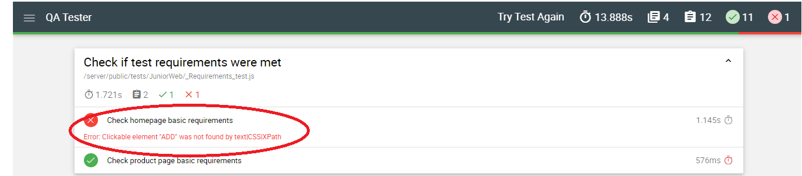
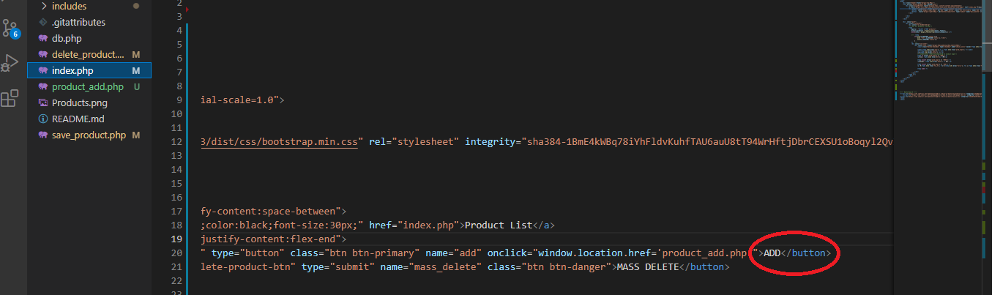
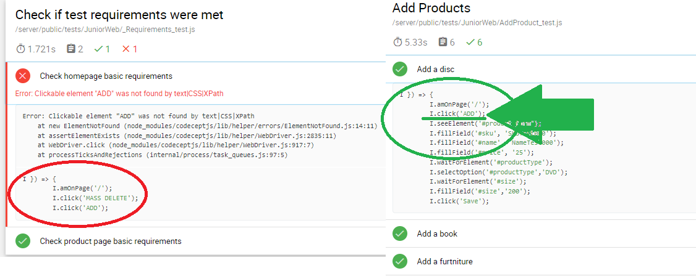
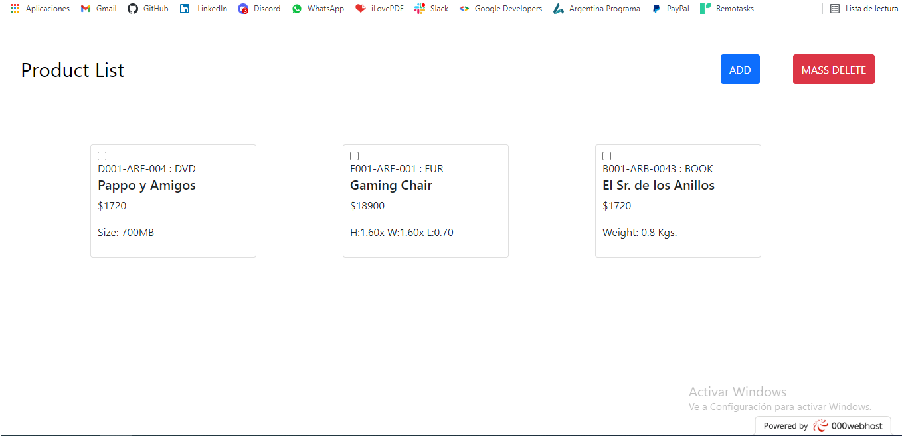

# Products
 Project made for ScandiWeb Test purposes.

### ScandiWeb Instructions : The expected outcome of the test

A web-app (accessible by an URL) containing two pages for:

1. Product list page
2. Adding a product page

### MUST HAVE for the list items:

- SKU (unique for each product)
- Name
- Price in $
- One of the product-specific attributes and its value
    - Size (in MB) for DVD-disc
    - Weight (in Kg) for Book
    - Dimensions (HxWxL) for Furniture

### Required UI elements:

- “ADD” button, which would lead to the “Product Add” page
- “MASS DELETE” action, implemented as checkboxes next to each product (should have a class: .delete-checkbox) and a button “MASS DELETE” triggering delete action for the selected products.
- There should be no pagination for the listing, all items should be on the same page
- Do not show any notification messages or alert windows loading the list or after submitting ADD new product dialogue

###   Product List Page 

### The page should display a form with id: #product_form, with the following fields:

- SKU (id: #sku)
- Name (id: #name)
- Price (id: #price)

- Product type switcher (id: #productType) with following options:
    - DVD (can be value or text)
    - Book (can be value or text)
    - Furniture (can be value or text)
    
- Product type-specific attribute
    - Size input field (in MB) for DVD-disc should have an ID: #size
    - Weight input field (in Kg) for Book should have an ID: #weight
    - Each from Dimensions input fields (HxWxL) for Furniture should have an appropriate ID:
        - Height - #height
        - Width - #width
        - Length - #length

## Finished? Now - time to AutoTest your work!

<aside>
💡 As already mentioned at the beginning of the task, AutoTesting with the result of "PASSED" is a **requirement** before submitting the task to HRs!

</aside>

This software helps you to understand what you might be missing in your assignment to us. It also helps you to check if all core elements of the assignment are working properly.

Just

1. Go to [AutoQA](http://165.227.98.170/)
2. Test your work!

# FINISHED PROJECT NOTES:

After some learning on PHP and MySQL, (I have never seen such programming languaje before) I was able to develop this Challenge:

I've found an interesting way to use SQL statements directly in PHP, so way simplified than PostgreSQL with Javascript!!
The challenge funcionality runs smoothly, but I've found a very strange error when I try to run QATest:

The QATest reject the project because it's not passing the test related to the "ADD" button needed for the challenge, so instead pass the 12th needed test to PASS the challenge, its only pass 11th;But as you can see in the next image, the button is in there:

Not to mention the "ADD" button is mandatory for the remaining test pass trough the challenge:

Having no idea why the QATester reject the project, I have start asking for help, on StackOverflow : https://stackoverflow.com/questions/70279990/qatester-weird-error-clickable-element-add-was-not-found-by-textcssxpath 
On Google, where i finish reading Selenium WebDriver: https://www.google.com/search?q=selenium+webdriver+clickable+element+add&oq=selenium+webdriver+clickable+element+add&aqs=chrome..69i57j0l5.5368j0j7&sourceid=chrome&ie=UTF-8 , Asking to my Teachers at HENRY, etc. 

Unfortunately, I've found no answer, so I've decided deliver the project as is it. I hope someone will answer me about this issue, and I'll be able to fix it.

Heres the link to the project:
https://scandiweb-challenge.000webhostapp.com/

